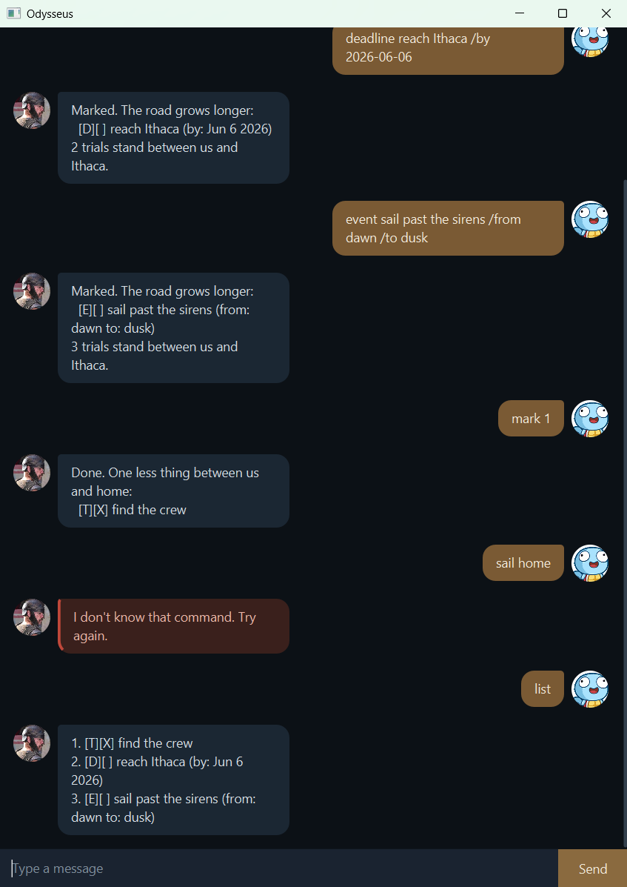

# Odysseus User Guide

Odysseus is a desktop chatbot for managing your tasks — todos, deadlines, and events —
through a simple typed command interface, themed after the long voyage home in Homer's
*Odyssey*. It keeps your tasks saved between sessions and runs as a JavaFX app.



## Quick start

1. Ensure you have Java 25 installed.
2. Download the latest `odysseus.jar` from the [Releases](https://github.com/rayyanwong/ip/releases) page.
3. Run it with `java -jar odysseus.jar` (or double-click the file).
4. Type a command in the box and press Enter. Try `todo find the crew`.

## Features

> **Note on dates:** deadlines use the format `YYYY-MM-DD` (e.g. `2026-06-06`).

### Adding a todo: `todo`

Adds a task with no date attached.

Format: `todo DESCRIPTION`

Example: `todo find the crew`

```
Marked. The road grows longer:
  [T][ ] find the crew
3 trials stand between us and Ithaca.
```

### Adding a deadline: `deadline`

Adds a task due by a specific date.

Format: `deadline DESCRIPTION /by YYYY-MM-DD`

Example: `deadline reach Ithaca /by 2026-06-06`

```
Marked. The road grows longer:
  [D][ ] reach Ithaca (by: Jun 6 2026)
4 trials stand between us and Ithaca.
```

### Adding an event: `event`

Adds a task that spans a start and end time.

Format: `event DESCRIPTION /from START /to END`

Example: `event sail past the sirens /from dawn /to dusk`

```
Marked. The road grows longer:
  [E][ ] sail past the sirens (from: dawn to: dusk)
5 trials stand between us and Ithaca.
```

### Listing all tasks: `list`

Shows every task in your list.

Format: `list`

### Marking a task done / not done: `mark`, `unmark`

Format: `mark INDEX` / `unmark INDEX`

Example: `mark 1`

```
Done. One less thing between us and home:
  [T][X] find the crew
```

### Deleting a task: `delete`

Removes the task at the given index.

Format: `delete INDEX`

Example: `delete 1`

```
Gone. We don't look back:
  [T][ ] find the crew
4 remain.
```

### Finding tasks by keyword: `find`

Lists every task whose description contains the keyword (case-insensitive).

Format: `find KEYWORD`

Example: `find crew`

### Listing tasks on a date: `on`

Lists the deadlines that fall on a given date.

Format: `on YYYY-MM-DD`

Example: `on 2026-06-06`

### Updating a task: `update`

Edits one field of an existing task in place, without deleting and re-adding it.

Format: `update INDEX /FLAG NEW_VALUE`

- `/desc` — change the description (any task type)
- `/by` — change a deadline's date (Deadline only, `YYYY-MM-DD`)
- `/from`, `/to` — change an event's start / end (Event only)

Example: `update 2 /desc buy oat milk`

```
The course corrects. Task 2:
  [D][ ] buy oat milk (by: Jun 6 2026)
```

### Exiting: `bye`

Closes the app.

Format: `bye`

```
Enough for today. The tide will turn.
```

## Notes

- **Duplicate tasks are rejected** — adding a task identical to an existing one is refused.
- **Your tasks are saved automatically** after every change, and reloaded on startup.

## Command summary

| Action   | Format                                  |
|----------|-----------------------------------------|
| Todo     | `todo DESCRIPTION`                      |
| Deadline | `deadline DESCRIPTION /by YYYY-MM-DD`   |
| Event    | `event DESCRIPTION /from START /to END` |
| List     | `list`                                  |
| Mark     | `mark INDEX`                            |
| Unmark   | `unmark INDEX`                          |
| Delete   | `delete INDEX`                          |
| Find     | `find KEYWORD`                          |
| On       | `on YYYY-MM-DD`                         |
| Update   | `update INDEX /FLAG NEW_VALUE`          |
| Exit     | `bye`                                   |
